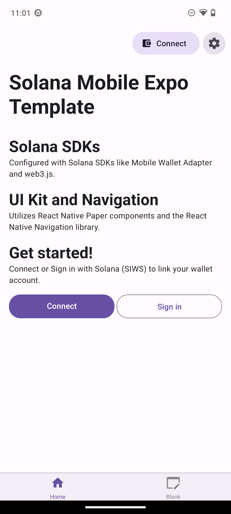
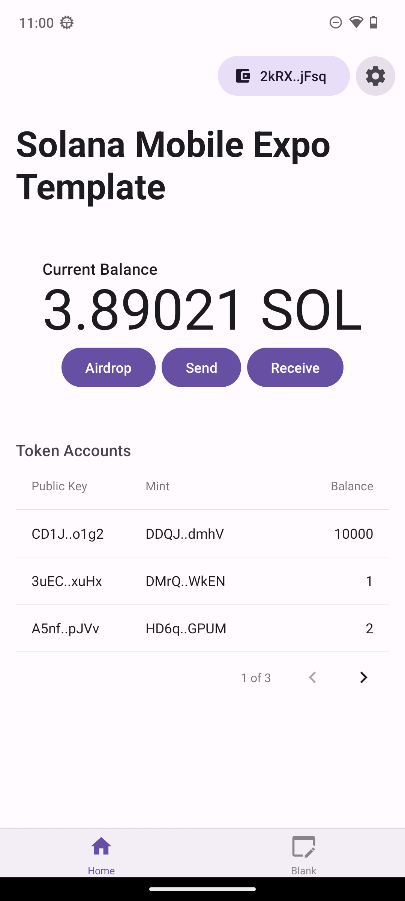
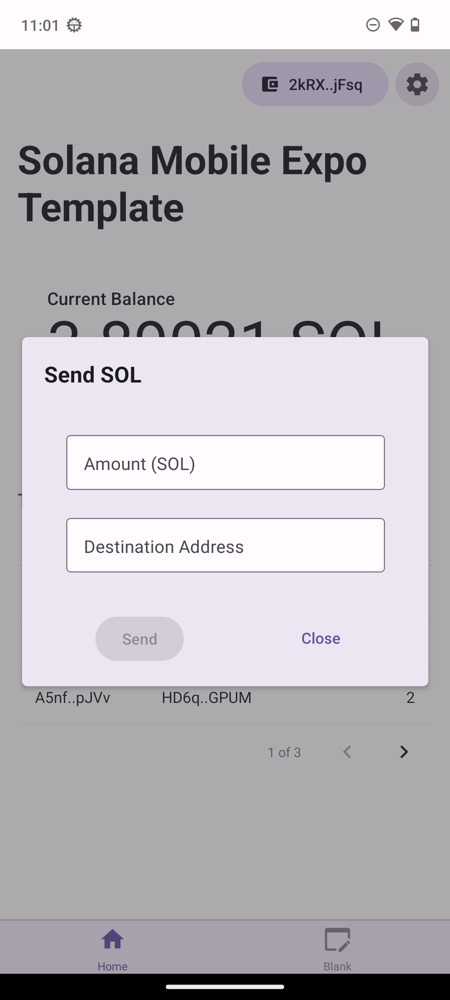

# Solana Mobile Expo Template

This template is a ready-to-go Android Expo dApp that offers:

- Solana libraries: `web3.js`, Mobile Wallet Adapter, and `spl-token`.
- Required polyfills like `crypto` and `Buffer` configured.
- Pre-built React UI and re-usable hooks and code patterns like `useMobileWallet`.

**This is only fully functional on Android.**

<table>
  <tr>
    <td align="center">
      
    </td>
    <td align="center">
      
    </td>
    <td align="center">
      
    </td>
  </tr>
</table>

## Tech Stack

| Library               | Category          | Version | Description                                           |
| --------------------- | ----------------- | ------- | ----------------------------------------------------- |
| React Native          | Mobile Framework  | v0.73   | The best cross-platform mobile framework              |
| Expo                  | SDK               | v50     | Allows (optional) Expo modules                        |
| React                 | UI Framework      | v18     | The most popular UI framework in the world            |
| Mobile Wallet Adapter | SDK               | v2.0    | Connect and request signing from mobile wallet apps   |
| Solana web3.js        | SDK               | v1.78   | General Solana library for transactions and RPCs      |
| spl-token             | SDK               | v0.41   | Library for building with Solana SPL tokens           |
| React Native Paper    | Component Library | v18     | Production-ready components following Material Design |
| React Navigation      | Navigation        | v6      | Performant and consistent navigation framework        |
| React Query           | State management  | v5.24   | Async query management                                |
| TypeScript            | Language          | v5      | Static typechecking                                   |
| AsyncStorage          | Persistence       | v1      | State persistence                                     |

## Quick Start

### Prerequisites

- A free [Expo](https://expo.dev/) account.
- An Android device/emulator to test your app
  - Install an MWA compliant wallet app on your device/emulator.
- If using Expo's cloud service `eas build`, no further setup is required.
- If building locally:
  - React Native and Android Envrionment [setup](https://docs.solanamobile.com/getting-started/development-setup)
 
  - 
 ## Overview 

# Lauch Applicatoin 📸

# Capure images/ beautify sites 

*** NoTE: Before the application would access your camera, you would need to grant camera permission and Location permision 
 

